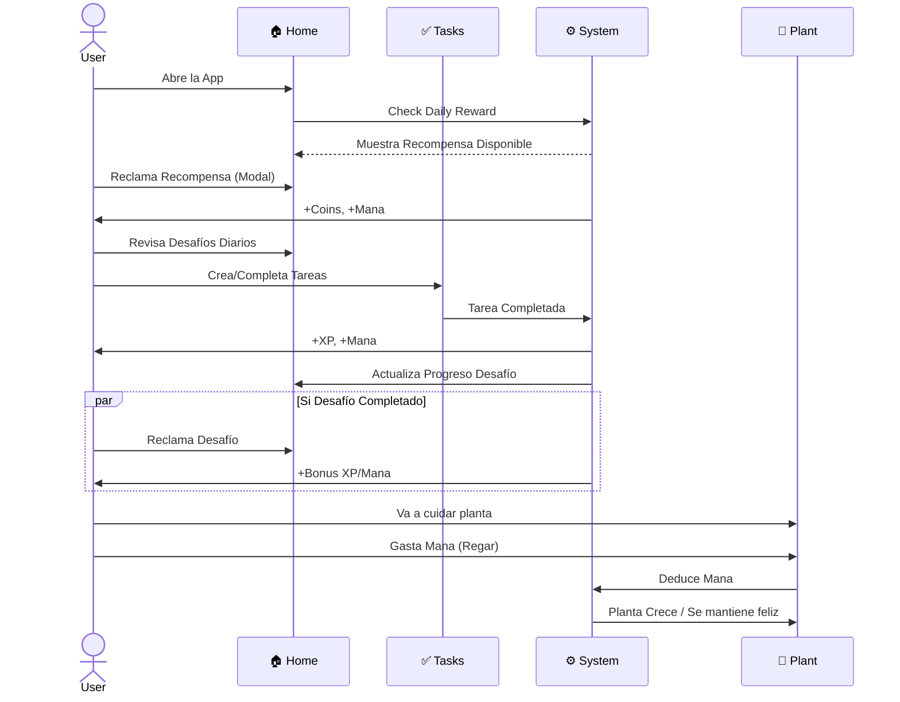
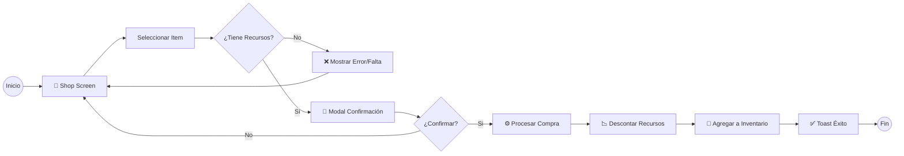

# 🗺️ Mapa Visual de la App

> **Propósito:** Visualizar la estructura, navegación y jerarquía de componentes de Mana Bloom.
> **Formato:** Diagramas Mermaid.

## 📱 Estructura de Navegación

Este diagrama muestra cómo se conectan las pantallas principales y sus componentes clave.

```mermaid
graph TD
    %% Estilos
    classDef screen fill:#2d1b4e,stroke:#9d4edd,stroke-width:2px,color:#fff;
    classDef component fill:#1a1a2e,stroke:#4a4e69,stroke-width:1px,color:#e0e1dd;
    classDef modal fill:#3d2c5e,stroke:#ff9e00,stroke-width:2px,stroke-dasharray: 5 5,color:#fff;
    classDef action fill:#0f3460,stroke:#00b4d8,color:#fff;

    App[📱 App Root] --> Tabs[Bottom Tab Navigator]
    
    %% HOME TAB
    subgraph HomeTab [🏠 Home Screen]
        direction TB
        Tabs --> Home[Home Screen]:::screen
        
        Home --> Header[🍔 Header & Menu]:::component
        Home --> Hero[🦸 Hero Section\n(Nivel, XP, Recursos)]:::component
        Home --> Promo[📢 Promo Slider\n(Banners)]:::component
        
        Home --> Rewards[🎁 Rewards Section]:::component
        Rewards -.->|Click| RewardModal[✨ Daily Reward Modal]:::modal
        Rewards -.->|Click| SocialModal[👥 Social Bonus Modal]:::modal
        
        Home --> Challenges[⚔️ Daily Challenges\n(3 Cards)]:::component

        Home --> MagicShop[🔮 Magic Shop Preview]:::component
        MagicShop -.->|Click| ShopTab
        
        Home --> News[📜 Arcane News]:::component
        
        Home --> Inventory[🎒 Inventory Preview]:::component
        Inventory -.->|Click| InventorySheet[📜 Inventory Sheet]:::modal
    end
    
    %% TASKS TAB
    subgraph TasksTab [✅ Tasks Screen]
        direction TB
        Tabs --> Tasks[Tasks Screen]:::screen
        
        Tasks --> TaskFilters[🔍 Filters & Search]:::component
        Tasks --> TaskList[📋 Task List]:::component
        TaskList --> TaskItem[📄 Task Item]:::component
        
        Tasks --> AddBtn[➕ FAB Add Button]:::action
        AddBtn -.->|Click| AddTaskModal[📝 Create Task Modal]:::modal
    end
    
    %% PLANT TAB
    subgraph PlantTab [🌱 Plant Screen]
        direction TB
        Tabs --> Plant[Plant Screen]:::screen
        
        Plant --> PlantHeader[📊 Stats Header]:::component
        Plant --> PlantVisual[🌿 Plant Visual\n(Evoluciona con Nivel)]:::component
        
        Plant --> CareActions[💧 Care Actions]:::component
        CareActions --> Water[Regar]:::action
        CareActions --> Prune[Podar]:::action
        CareActions --> Fertilize[Fertilizar]:::action
        
        Plant --> Rituals[🧘 Rituals Section]:::component
    end
    
    %% SHOP TAB
    subgraph ShopTab [🛒 Shop Screen]
        direction TB
        Tabs --> Shop[Shop Screen]:::screen
        
        Shop --> Categories[📂 Categories Tab]:::component
        Shop --> Catalog[🧪 Items Grid]:::component
        Catalog --> ShopItem[📦 Shop Item Card]:::component
        
        ShopItem -.->|Click| PurchaseModal[💰 Purchase Confirm]:::modal
    end
    
    %% PROFILE TAB
    subgraph ProfileTab [👤 Profile Screen]
        direction TB
        Tabs --> Profile[Profile Screen]:::screen
        
        Profile --> UserInfo[👤 Avatar & Info]:::component
        Profile --> StatsSummary[📊 Stats Summary]:::component
        Profile --> Achievements[🏆 Achievements List]:::component
        Profile --> Settings[⚙️ Settings]:::component
    end
```

## 🔄 Flujos de Usuario Clave

### 1. Ciclo Diario (Core Loop)



### 2. Flujo de Compra


